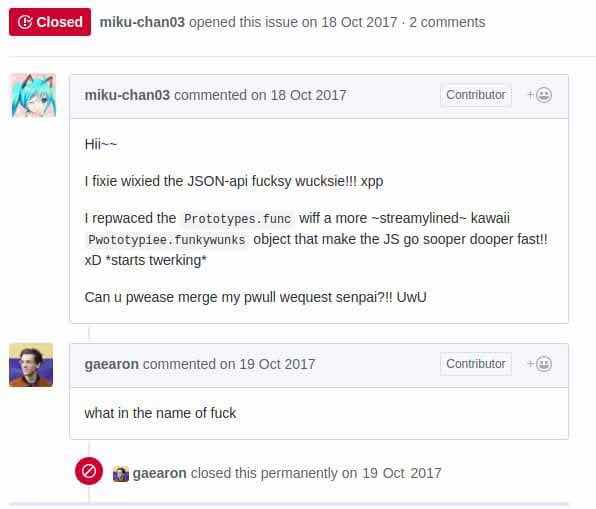

<!-- :toc: macro -->
<!-- :toc-title: -->
<!-- :toclevels: 99 -->

# Style guide for justapenguin_ca repo <!-- omit from toc -->

## tl;dr <!-- omit from toc -->

Optimize for readability. Write detailed documentation.
Make error messages useful.
Never use timeouts or timers.
Avoid `is`, `print` and `part of`.

## Introduction <!-- omit from toc -->

This document contains some high-level philosophy and policy decisions for the justapenguin_ca
project, and a description of specific style issues for some parts of the codebase.

The style portion describes the preferred style for code written as part of the justapenguin_ca
project (the server and website itself and all our sample code).

## Table of Contents <!-- omit from toc -->

* [Overview](#overview)
  * [A word on designing APIs](#a-word-on-designing-apis)
* [Philosophy](#philosophy)
  * [Lazy programming](#lazy-programming)
  * [Write Test, Find Bug](#write-test-find-bug)
  * [No synchronous slow work](#no-synchronous-slow-work)
  * [Avoid interleaving multiple concepts together](#avoid-interleaving-multiple-concepts-together)
  * [Avoid secret (or global) state](#avoid-secret-or-global-state)
  * [Prefer general APIs, but use dedicated APIs where there is a reason](#prefer-general-apis-but-use-dedicated-apis-where-there-is-a-reason)
  * [Avoid the lowest common denominator](#avoid-the-lowest-common-denominator)
  * [Avoid APIs that encourage bad practices](#avoid-apis-that-encourage-bad-practices)
  * [Avoid exposing API cliffs](#avoid-exposing-api-cliffs)
  * [Avoid exposing API oceans](#avoid-exposing-api-oceans)
  * [Avoid heuristics and magic](#avoid-heuristics-and-magic)
  * [Get early feedback when designing new APIs](#get-early-feedback-when-designing-new-apis)
  * [Start designing APIs from the closest point to the developer](#start-designing-apis-from-the-closest-point-to-the-developer)
  * [Only log actionable messages to the console](#only-log-actionable-messages-to-the-console)
  * [Error messages should be useful](#error-messages-should-be-useful)
* [Policies](#policies)
  * [Avoid abandonware](#avoid-abandonware)
* [Documentation](#documentation)
  * [Answer your own questions straight away](#answer-your-own-questions-straight-away)
  * [Avoid useless documentation](#avoid-useless-documentation)
  * [Writing prompts for good documentation](#writing-prompts-for-good-documentation)
  * [Introduce terms as if every piece of documentation is the first the reader has ever seen](#introduce-terms-as-if-every-piece-of-documentation-is-the-first-the-reader-has-ever-seen)
  * [Avoid empty prose](#avoid-empty-prose)
  * [Leave breadcrumbs in the comments](#leave-breadcrumbs-in-the-comments)
  * [Refactor the code when the documentation would be incomprehensible](#refactor-the-code-when-the-documentation-would-be-incomprehensible)
  * [Canonical terminology](#canonical-terminology)
  * [Use correct grammar](#use-correct-grammar)
  * [Use the passive voice; recommend, do not require; never say things are simple](#use-the-passive-voice-recommend-do-not-require-never-say-things-are-simple)
  * [Provide sample code](#provide-sample-code)
    * [Provide full application samples](#provide-full-application-samples)
  * [Clearly mark deprecated APIs](#clearly-mark-deprecated-apis)
  * [Use `///` for public-quality private documentation](#use--for-public-quality-private-documentation)
  * [Doxygen-specific requirements](#doxygen-specific-requirements)
* [Coding patterns and catching bugs early](#coding-patterns-and-catching-bugs-early)
  * [Use asserts liberally to detect contract violations and verify invariants](#use-asserts-liberally-to-detect-contract-violations-and-verify-invariants)
  * [Prefer specialized functions, methods and constructors](#prefer-specialized-functions-methods-and-constructors)
  * [Minimize the visibility scope of constants](#minimize-the-visibility-scope-of-constants)
  * [Avoid using `if` chains or `?:` or `==` with enum values](#avoid-using-if-chains-or--or--with-enum-values)
  * [Avoid using `auto`](#avoid-using-auto)
  * [Avoid using `library` and `part of`](#avoid-using-library-and-part-of)
  * [Never check if a port is available before using it, never add timeouts, and other race conditions](#never-check-if-a-port-is-available-before-using-it-never-add-timeouts-and-other-race-conditions)
  * [Avoid mysterious and magical numbers that lack a clear derivation](#avoid-mysterious-and-magical-numbers-that-lack-a-clear-derivation)
  * [Test APIs belong in the test](#test-apis-belong-in-the-test)
  * [Immutable classes should not have hidden state](#immutable-classes-should-not-have-hidden-state)
  * [Avoid `function*`](#avoid-function)
* [Naming](#naming)
  * [Avoid abbreviations](#avoid-abbreviations)
  * [Avoid anonymous parameter names](#avoid-anonymous-parameter-names)
  * [Naming rules for `typedef`s and function variables](#naming-rules-for-typedefs-and-function-variables)
  * [Spell words in identifiers and comments correctly](#spell-words-in-identifiers-and-comments-correctly)
  * [Capitalize identifiers consistent with their spelling](#capitalize-identifiers-consistent-with-their-spelling)
  * [Avoid double negatives in APIs](#avoid-double-negatives-in-apis)
  * [Qualify variables and methods used only for debugging](#qualify-variables-and-methods-used-only-for-debugging)
  * [Avoid naming undocumented libraries](#avoid-naming-undocumented-libraries)
* [Comments](#comments)
  * [Avoid checking in comments that ask questions](#avoid-checking-in-comments-that-ask-questions)
* [Formatting](#formatting)
  * [In defense of the extra work that hand-formatting entails](#in-defense-of-the-extra-work-that-hand-formatting-entails)
  * [Constructors come first in a class](#constructors-come-first-in-a-class)
  * [Order other class members in a way that makes sense](#order-other-class-members-in-a-way-that-makes-sense)
  * [Constructor syntax](#constructor-syntax)
  * [Prefer a maximum line length of 80 characters](#prefer-a-maximum-line-length-of-80-characters)
  * [Indent multi-line argument and parameter lists by 4 characters](#indent-multi-line-argument-and-parameter-lists-by-4-characters)
  * [If you have a newline after some opening punctuation, match it on the closing punctuation](#if-you-have-a-newline-after-some-opening-punctuation-match-it-on-the-closing-punctuation)
  * [Prefer double quotes for strings](#prefer-double-quotes-for-strings)
  * [Separate the `if` expression from its statement](#separate-the-if-expression-from-its-statement)
  * [Align expressions](#align-expressions)
  * [Prefer `+=` over `++`](#prefer--over-)
  * [Use double literals for double constants](#use-double-literals-for-double-constants)
* [Conventions](#conventions)
  * [Expectations around potential crashes](#expectations-around-potential-crashes)
  * [Features we expect every to implement](#features-we-expect-every-to-implement)
* [Packages](#packages)
  * [Structure](#structure)
  * [Deciding where to put code](#deciding-where-to-put-code)

## Overview

This document describes our approach to designing and programming justapenguin_ca,
from high-level architectural principles all the way to indentation rules.
These are our norms, written down so that we can easily convey our shared
understanding with new team members.

The primary goal of these style guidelines is to improve code readability so
that everyone, whether reading the code for the first time or
maintaining it for years, can quickly determine what the code does.
Secondary goals are to design systems that are simple, to increase the
likelihood of catching bugs quickly, and avoiding arguments when there are
disagreements over subjective matters.

### A word on designing APIs

Designing an API is an art. Like all forms of art, one learns by practicing. The best way to get good at designing APIs is to spend a decade or more designing them, while working closely with people who are using your APIs. Ideally, one would first do this in very controlled situations, with small numbers of developers using one's APIs, before graduating to writing APIs that will be used by hundreds of thousands or even millions of developers.

In the absence of one's own experience, one can attempt to rely on the experience of others. The biggest problem with this is that sometimes explaining why an API isn't optimal is a very difficult and subtle task, and sometimes the reasoning doesn't sound convincing unless you already have a lot of experience designing them.

Because of this, and contrary to almost any other situation in engineering, when you are receiving feedback about API design from an experienced API designer, they will sometimes seem unhappy without quite being able to articulate why. When this happens, seriously consider that your API should be scrapped and a new solution found.

This requires a different and equally important skill when designing APIs: not getting attached to one's creations. One should try many wildly different APIs, and then attempt to write code that uses those APIs, to see how they work. Throw away APIs that feel frustrating, that lead to buggy code, or that other people don't like. If it isn't elegant, it's usually better to try again than to forge ahead.

An API is for life, not just for the one PR you are working on.

## Philosophy

### Lazy programming

Write what you need and no more, but when you write it, do it right.

Avoid implementing features you don't need. You can't design a feature
without knowing what the constraints are. Implementing features "for
completeness" results in unused code.

When you do implement a feature, implement it the right way. Avoid
workarounds. Workarounds merely kick the problem further down the
road, but at a higher cost: someone will have to relearn the problem,
figure out the workaround and how to dismantle it (and all the places
that now use it), _and_ implement the feature. It's much better to
take longer to fix a problem properly, than to be the one who fixes
everything quickly but in a way that will require cleaning up later.

You may hear team members say "embrace the [yak shave](http://www.catb.org/jargon/html/Y/yak-shaving.html)!". This is
an encouragement to [take on the larger effort necessary](https://www.youtube.com/watch?v=AbSehcT19u0) to perform a
proper fix for a problem rather than just applying a band-aid.

### Write Test, Find Bug

When you fix a bug, first write a test that fails, then fix the bug
and verify the test passes.

When you implement a new feature, write tests for it.

If something isn't tested, it is very likely to regress or to get "optimized away".
If you want your code to remain in the codebase, you should make sure to test it.

Don't submit code with the promise to "write tests later". Just take the
time to write the tests properly and completely in the first place.

### No synchronous slow work

There should be no APIs that require synchronously completing an
expensive operation. Expensive work should be asynchronous.

### Avoid interleaving multiple concepts together

Each API should be self-contained and should not know about other features.
Interleaving concepts leads to _complexity_.

For example:

* Render objects each solve a single problem. Rather than having a render object
handle both clipping and opacity, we may have one render object for clipping,
and one for opacity.

### Avoid secret (or global) state

A function should operate only on its arguments and, if it is an instance
method, data stored on its object. This makes the code significantly easier
to understand.

For example, when reading this code:

```c++
// ... imports something that defines foo and bar ...

int main( void ) {
  foo( 1 );

  bar( 2 );
}
```

...the reader should be confident that nothing in the call to `foo` could affect anything in the
call to `bar`.

This usually means structuring APIs so that they either take all relevant inputs as arguments, or so
that they are based on objects that are created with the relevant input, and can then be called to
operate on those inputs.

This significantly aids in making code testable and in making code understandable and debug-able.
When code operates on secret global state, it's much harder to reason about.

### Prefer general APIs, but use dedicated APIs where there is a reason

For example, having dedicated APIs for performance reasons is fine. If one
specific operation, say clipping a rounded rectangle, is expensive
using the general API but could be implemented more efficiently
using a dedicated API, then that is where we would create a dedicated API.

### Avoid the lowest common denominator

It is common to provide APIs that work on all their target platforms.
Unfortunately, this usually means that features that are unique
to one platform or another are unavailable.

For justapenguin_ca, we want to avoid this by explicitly aiming to be the best way
to develop for each platform individually. Our ability to be used cross-
platform is secondary to our ability to be used on each platform.

### Avoid APIs that encourage bad practices

For example, don't provide APIs that walk entire trees, or that encourage
O(N^2) algorithms, or that encourage sequential long-lived operations where
the operations could be run concurrently.

In particular:

* String manipulation to generate data or code that will subsequently
  be interpreted or parsed is a bad practice as it leads to code
  injection vulnerabilities.

* If an operation is expensive, that expense should be represented
  in the API (e.g. by returning a `function*` or a `coroutine`). Avoid
  providing APIs that hide the expense of tasks.

### Avoid exposing API cliffs

Convenience APIs that wrap some aspect of a service from one environment
for exposure in another environment,
should expose/ wrap the complete API, so that there's no cognitive cliff
when interacting with that service (where you are fine using the exposed
API up to a point, but beyond that have to learn all about the underlying
service).

### Avoid exposing API oceans

APIs that wrap underlying services but prevent the underlying API from
being directly accessed should carefully expose only the best parts
of the underlying API. This may require refactoring features so that
they are more usable. It may mean avoiding exposing convenience
features that abstract over expensive operations unless there's a
distinct performance gain from doing so. A smaller API surface is easier
to understand.

### Avoid heuristics and magic

Predictable APIs that the developer feels gives them control are generally preferred
over APIs that mostly do the right thing but don't give the developer any way to adjust
the results.

Predictability is reassuring.

### Get early feedback when designing new APIs

If you're designing a new API or a new feature, consider [writing a design doc](Design_Documents.md).
Then, get feedback from the relevant people.

### Start designing APIs from the closest point to the developer

When we create a new feature that requires a change to the entire stack, it's tempting to design the lowest-level API first, since that's the closest to the "interesting" code (the "business end" of the feature, where we actually do the work). However, that then forces the higher level APIs to be designed against the lower-level API, which may or may not be a good fit, and eventually the top-level API, which developers will primarily be using, may be forced to be a tortured and twisted mess (either in implementation or in terms of the exposed API). It may even be that the final API doesn't fit how people think about the problem or solve their actual issues, but instead merely exposes the lowest-level feature almost verbatim.

Instead, always design the top-level API first. Consider what the most ergonomic API would be at the level that most developers will be interacting with it. Then, once that API is cleanly designed and usability-tested, build the lower levels so that the higher level can be layered atop.

### Only log actionable messages to the console

If the logs contain messages that the user can safely ignore, then they will do so, and eventually their logs
will be so chatty and verbose that they will miss the critical messages. Therefore, only log actual errors and
actionable warnings (warnings that can always be dealt with and fixed).

Never log "informational" messages by default. It is possible that it may be useful to have messages on certain topics while debugging those topics. To deal with that, have debug flags you can enable that enable extra logging for particular topics.

This also applies to our debug builds. It's annoying for other people on the team to have to wade through messages that aren't directly relevant to their work. Rely on feature flags, not verbosity levels, when deciding
to output messages. The one exception to this is reporting useful milestones.

### Error messages should be useful

Every time you find the need to report an error (e.g. throwing an exception, handling some bad state, reporting a syntax error in the JS compiler, etc), consider how you can make this the most useful and helpful error message ever.

Put yourself in the shoes of whoever sees that error message. Why did they see it? What can we do to help them? They are at a crossroads, having seen your error message: they can either get frustrated and hate justapenguin_ca, or they can feel thankful that the error helped them resolve an actual issue. **Every error message is an opportunity to make someone love our product.**

## Policies

This section defines some policies that we have decided to honor. In the absence of a very specific policy in this section, the general philosophies in the section above are controlling.

### Avoid abandonware

Code that is no longer maintained should be deleted or archived in some way that clearly indicates
that it is no longer maintained.

For example, we delete rather than commenting out code. Commented-out code will bit rot too fast to be
useful, and will confuse people maintaining the code.

## Documentation

We use "Doxygen" for our C++ documentation. All public members in justapenguin_ca should have a documentation.

### Answer your own questions straight away

When working on justapenguin_ca, if you find yourself asking a question about
our systems, please place whatever answer you subsequently discover
into the documentation in the same place where you first looked for
the answer. That way, the documentation will consist of answers to real
questions, where people would look to find them. Do this right away;
it's fine if your otherwise-unrelated PR has a bunch of documentation
fixes in it to answer questions you had while you were working on your PR.

We try to avoid reliance on "oral tradition". It should be possible
for anyone to begin contributing without having had to learn all the
secrets from existing team members. To that end, all processes should
be documented, code should be self-explanatory or commented,
and conventions should be written down, e.g. in our style guide.

There is one exception: it's better to _not_ document something
than to document it poorly. This is because if you don't document it,
it still appears on list of things to document. Feel free to remove
documentation that violates our rules below (especially the next one),
so as to make it reappear on the list.

### Avoid useless documentation

If someone could have written the same documentation without knowing
anything about the class other than its name, then it's useless.

Avoid checking in such documentation, because it is no better than no
documentation but will prevent us from noticing that the identifier is
not actually documented.

Example:

```c++
// BAD:

/// The background color.
const color_t backgroundColor;

/// Half the diameter of the circle.
const double radius;


// GOOD:

/// The color with which to fill the circle.
///
/// Changing the background color will cause the avatar to animate to the new color.
const color_t backgroundColor;

/// The size of the avatar.
///
/// Changing the radius will cause the avatar to animate to the new size.
const double radius;
```

### Writing prompts for good documentation

If you are having trouble coming up with useful documentation, here are some prompts that might help you write more detailed prose:

* If someone is looking at this documentation, it means that they have a question which they couldn't answer by guesswork or by looking at the code. What could that question be? Try to answer all questions you can come up with.

* If you were telling someone about this property, what might they want to know that they couldn't guess? For example, are there edge cases that aren't intuitive?

* Consider the type of the property or arguments. Are there cases that are outside the normal range that should be discussed? e.g. negative numbers, non-integer values, transparent colors, empty arrays, infinities, NaN, null? Discuss any that are non-trivial.

* Does this member interact with any others? For example, can it only be non-null if another is null? Will this member only have any effect if another has a particular range of values? Will this member affect whether another member has any effect, or what effect another member has?

* Does this member have a similar name or purpose to another, such that we should point to that one, and from that one to this one? Use the `See also:` pattern.

* Are there timing considerations? Any potential race conditions?

* Are there lifecycle considerations? For example, who owns the object that this property is set to?

* What is the contract for this property/ method? Can it be called at any time? Are there limits on what values are valid? If this is a constructor, are any of the arguments not nullable?

### Introduce terms as if every piece of documentation is the first the reader has ever seen

It's easy to assume that the reader has some basic knowledge of C++ or JavaScript or justapenguin_ca when writing API documentation.

Unfortunately, the reality is that everyone starts knowing nothing, and we do not control where they will begin their journey.

For this reason, avoid using terms without first defining them, unless you are linking to more fundamental documentation that defines that term without reference to the API you are documenting.

For example, a fancy widget in the Material library can refer to the `StatefulWidget` documentation and assume that the reader either knows about the `StatefulWidget` class, or can learn about it by following the link and then later returning to the documentation for the fancy widget. However, the documentation for the `StatefulWidget` class should avoid assuming that the reader knows what a `State` class is, and should avoid deferring to it for its definition, because `State` could is likely to defer back to `StatefulWidget` and the reader would be stuck in a loop unable to grasp the basic principles. This is the documentation equivalent of a bootstrapping problem.

Another way to express this is that API documentation should follow a similar layering philosophy as code. The goal of documentation is not just to act as a refresher for experts, but to act as a tutorial for new developers.

### Avoid empty prose

It's easy to use more words than necessary. Avoid doing so
where possible, even if the result is somewhat terse.

```c++
// BAD:

/// Note: It is important to be aware of the fact that in the
/// absence of an explicit value, this property defaults to 2.

// GOOD:

/// Defaults to 2.
```

In particular, avoid saying "Note:", or starting a sentence with "Note that". It adds nothing.

### Leave breadcrumbs in the comments

This is especially important for documentation at the level of classes.

If a class is constructed using a builder of some sort, or can be
obtained via some mechanism other than merely calling the constructor,
then include this information in the documentation for the class.

If a class is typically used by passing it to a particular API, then
include that information in the class documentation also.

If a method is the main mechanism used to obtain a particular object,
or is the main way to consume a particular object, then mention that
in the method's description.

`typedef`s should mention at least one place where the signature is used.

These rules result in a chain of breadcrumbs that a reader can follow
to get from any class or method that they might think is relevant to
their task all the way up to the class or method they actually need.

Example:

```c++
// GOOD:

/// An object representing a sequence of recorded graphical operations.
///
/// To create a [Picture], use a [PictureRecorder].
///
/// A [Picture] can be placed in a [Scene] using a [SceneBuilder], via
/// the [SceneBuilder.addPicture] method. A [Picture] can also be
/// drawn into a [Canvas], using the [Canvas.drawPicture] method.
class picture ...
```

You can also use "See also" links, is in:

```c++
/// See also:
///
/// * [FooBar], which is another way to peel oranges.
/// * [Baz], which quuxes the wibble.
```

Each line should end with a period. Prefer "which..." rather than parenthetical on such lines.
There should be a blank line between "See also:" and the first item in the bulleted list.

### Refactor the code when the documentation would be incomprehensible

If writing the documentation proves to be difficult because the API is
convoluted, then rewrite the API rather than trying to document it.

### Canonical terminology

The documentation should use consistent terminology:

* _method_ - a member of a class that is a non-anonymous closure
* _function_ - a callable non-anonymous closure that isn't a member of a class
* _parameter_ - a variable defined in a closure signature and possibly used in the closure body.
* _argument_ - the value passed to a closure when calling it.

Prefer the term "call" to the term "invoke" when talking about jumping to a closure.

Prefer the term "member variable" to the term "instance variable" when talking about variables associated with a specific object.

### Use correct grammar

Avoid starting a sentence with a lowercase letter.

```c++
// BAD

/// [foo] must not be null.

// GOOD

/// The [foo] argument must not be null.
```

Similarly, end all sentences with a period.

### Use the passive voice; recommend, do not require; never say things are simple

Never use "you" or "we". Avoid the imperative voice. Avoid value judgments.

Rather than telling someone to do something, use "Consider", as in "`To obtain the foo, consider using [bar].`".

In general, you don't know who is reading the documentation or why. Someone could have inherited a terrible codebase and be reading our documentation to find out how to fix it; by saying "you should not do X" or "avoid Y" or "if you want Z", you will put the reader in a defensive state of mind when they find code that contradicts the documentation (after all, they inherited this codebase, who are we to say that they're doing it wrong).

For similar reasons, never use the word "simply", or say that the reader need "just" do something, or otherwise imply that the task is easy.
By definition, if they are looking at the documentation, they are not finding it easy.

### Provide sample code

Sample code helps developers learn your API quickly. Writing sample code also helps you think through how your API is going to be used by app developers.

Sample code should go in a documentation comment that typically begins with `/// @code {.cpp}`, and ends with `/// @endcode`, with the example source and corresponding tests placed in a file under [the API examples directory](./examples/api).

#### Provide full application samples

Our UX research has shown that developers prefer to see examples that are in the context of an entire app. So, whenever it makes sense, provide an example that can be presented as part of an entire application instead of just a snippet.

### Clearly mark deprecated APIs

We have conventions around deprecations. See the [Tree Hygiene](Tree_hygiene.md#deprecations) page for more details.

### Use `///` for public-quality private documentation

In general, private code can and should also be documented. If that documentation is of good enough
quality that we could include it verbatim when making the class public (i.e. it satisfies all the
style guidelines above), then you can use `///` for those docs, even though they're private.

Documentation of private APIs that is not of sufficient quality should only use `//`. That way, if
we ever make the corresponding class public, those documentation comments will be flagged as missing,
and we will know to examine them more carefully.

Feel free to be conservative in what you consider "sufficient quality". It's ok to use `//` even if
you have multiple paragraphs of documentation; that's a sign that we should carefully re-review the
documentation when making the code public.

### Doxygen-specific requirements

The first paragraph of any Doxygen section must be a short self-contained sentence that explains the purpose
and meaning of the item being documented. Subsequent paragraphs then must elaborate. Avoid having the first paragraph have multiple sentences. (This is because the first paragraph gets extracted and used in tables of
contents, etc, and so has to be able to stand alone and not take up a lot of room.)

When referencing a parameter, use backticks. However, when referencing a parameter that also corresponds to a property, use square brackets instead. (We want to avoid cases where a parameter that happens to be named the same as a property despite having no relationship to that property gets linked to the property.)

```c++
// GOOD

  /// Creates a foobar, which allows a baz to quux the bar.
  ///
  /// The [bar] argument must not be null.
  ///
  /// The `baz` argument must be greater than zero.
  foo( int baz ) : assert( bar != null ), assert( baz > 0 );
```

Avoid using terms like "above" or "below" to reference one section from another. Sections are often shown alone on a page, the full context of the class is not present.

## Coding patterns and catching bugs early

### Use asserts liberally to detect contract violations and verify invariants

`assert()` allows us to be diligent about correctness without paying a
performance penalty in release mode, because only evaluates asserts in
debug mode.

It should be used to verify contracts and invariants are being met as we expect.
Asserts do not _enforce_ contracts, since they do not run at all in release builds.
They should be used in cases where it should be impossible for the condition
to be false without there being a bug somewhere in the code.

### Prefer specialized functions, methods and constructors

Use the most relevant constructor or method, when there are multiple
options.

Example:

```c++
// BAD:
edgeInsets.TRBL( 0.0, 8.0, 0.0, 8.0 );

// GOOD:
edgeInsets.symmetric( horizontal: 8.0 );
```

### Minimize the visibility scope of constants

Prefer using a local const or a static const in a relevant class/ function than using a
global constant.

As a general rule, when you have a lot of constants, wrap them in a
class.

### Avoid using `if` chains or `?:` or `==` with enum values

Use `switch` with no `default` case if you are examining an enum. Unused values can be grouped together with a single `break` or `return` as appropriate.

Avoid using `if` chains, `? ... : ...`, or, in general, any expressions involving enums.

### Avoid using `auto`

All variables and arguments are typed; avoid `auto` in
any case where you could figure out the actual type. Always specialize
generic types where possible. Explicitly type all list and map
literals. Give types to all parameters.

This achieves two purposes: it verifies that the type that the compiler
would infer matches the type you expect, and it makes the code self-documenting
in the case where the type is not obvious (e.g. when calling anything other
than a constructor).

### Avoid using `library` and `part of`

Prefer that each library be self-contained. Only name a `library` if you are documenting it (see the
documentation section).

We avoid using `part of` because that feature makes it very hard to reason about how private a private
really is, and tends to encourage "spaghetti" code (where distant components refer to each other) rather
than "lasagna" code (where each section of the code is cleanly layered and separable).

### Never check if a port is available before using it, never add timeouts, and other race conditions

If you look for an available port, then try to open it, it's extremely likely that several times a week some other code will open that port between your check and when you open the port, and that will cause a failure.

> Instead, have the code that opens the port pick an available port and return it, rather than being given a (supposedly) available port.

If you have a timeout, then it's very likely that several times a week some other code will happen to run while your timeout is running, and your "really conservative" timeout will trigger even though it would have worked fine if the timeout was one second longer, and that will cause a failure.

> Instead, have the code that would time out just display a message saying that things are unexpectedly taking a long time.

Race conditions like this are the primary cause of flaky tests, which waste everyone's time.

Similarly, avoid delays or sleeps that are intended to coincide with how long something takes. You may think that waiting two seconds is fine because it normally takes 10ms, but several times a week your 10ms task will actually take 2045ms and your test will fail because waiting two seconds wasn't long enough.

> Instead, wait for a triggering event.

### Avoid mysterious and magical numbers that lack a clear derivation

Numbers in tests and elsewhere should be clearly understandable.
Consider either leaving the expression or adding a clear comment (bonus points for leaving a diagram).

### Test APIs belong in the test

Mechanisms that exist for test purposes do not belong in the core libraries, they belong in test harnesses. This keeps the cost of the main library down in production and avoids the risk that people might abuse test APIs.

### Immutable classes should not have hidden state

Immutable classes (those with `const` constructors) should not have hidden state. For example, they should not use private statics. Otherwise they should not be `const`.

### Avoid `function*`

Using generator functions (`function*`) can be a powerful improvement when callers will
actually lazily evaluate the iterable and each iteration is expensive _or_ there are a very
large number of iterations.

It should not be used in place of building and returning an `array`, particularly for trivial methods
that only yield a small number of members or when callers will evaluate the whole collection
anyway. It should also be avoided in very large functions.

## Naming

### Avoid abbreviations

Unless the abbreviation is more recognizable than the expansion (e.g. XML, HTTP, JSON), expand abbreviations
when selecting a name for an identifier. In general, avoid one-character names
(for example, prefer `index` over `i`).

### Avoid anonymous parameter names

Provide full names even for parameters that are otherwise unused. This makes it easier for
people reading the code to tell what is actually going on (e.g. what is being ignored). For example:

```js
{
  onTapDown: ( _details ) { print( "hello!" ); }, // GOOD
  onTapUp: ( _ ) { print( "good bye" ); }, // BAD
}
```

### Naming rules for `typedef`s and function variables

When naming callbacks, use `fooCallback_t` for the typedef, `_onFoo` for
the callback argument or property, and `handleFoo` for the method
that is called. If `foo` is a verb, prefer the present tense to the
past tense (e.g. `onTap` instead of `onTapped`).

If you have a callback with arguments but you want to ignore the
arguments, give the type and names of the arguments anyway. That way,
if someone copies and pastes your code, they will not have to look up
what the arguments are.

Never call a method `_onFoo`. If a property is called `_onFoo` it must be
a function type. (For all values of "foo".)

Prefer using `typedef`s to declare callbacks. Typedefs benefit from having
documentation on the type itself and make it easier to read and find
common callsites for the signature.

### Spell words in identifiers and comments correctly

Our primary source of truth is dictionaries.

Avoid "cute" spellings. For example, 'colors', not 'colorz'.

Prefer US English spellings. For example, 'colorize', not 'colourise', and 'canceled', not 'cancelled'.



### Capitalize identifiers consistent with their spelling

If a word is correctly spelled (according to our sources of truth as described in the previous section) as a single word, then it should not have any inner capitalization or spaces.

For examples, prefer `toolbar`, `scrollbar`, but `appBar` ('app bar' in documentation), `tabBar` ('tab bar' in documentation).

Similarly, prefer `offstage` rather than `offStage`.

### Avoid double negatives in APIs

Name your boolean variables in positive ways, such as "enabled" or "visible", even if the default value is true.

This is because, when you have a property or argument named "disabled" or "hidden", it leads to code such as `input.disabled = false` or `widget.hidden = false` when you're trying to enable or show the widget, which is very confusing.

### Qualify variables and methods used only for debugging

If you have variables or methods (or even classes!) that are only used in debug mode,
prefix their names with `debug` or `_debug` (or, for classes, `_debug`).

Do not use debugging variables or methods (or classes) in production code.

### Avoid naming undocumented libraries

In other words, do not use the `library` keyword, unless it is a
documented top-level library intended to be imported by users.

## Comments

### Avoid checking in comments that ask questions

Find the answers to the questions, or describe the confusion, including
references to where you found answers.

If commenting on a workaround due to a bug, also leave a link to the issue and
a TODO to clean it up when the bug is fixed.

Example:

```c++
// BAD:

// What should this be?

// This is a workaround.


// GOOD:

// According to this specification, this should be 2.0, but according to that
// specification, it should be 3.0. We split the difference and went with
// 2.5, because we didn't know what else to do.

// TODO( username ): Converting color to RGB because class Color doesn't support
//                   hex yet. See http://link/to/a/bug/123
```

TODOs should include the string TODO in all caps, followed by the GitHub username of
the person with the best _context_ about the problem referenced by the TODO in
parenthesis. A TODO is not a commitment that the person referenced will fix the
problem, it is intended to be the person with enough context to explain the problem.
Thus, when you create a TODO, it is almost always your username that is given.

Including an issue link in a TODO description is required.

## Formatting

We do use `clang-format` for both C/ C++ and JavaScript files.

### In defense of the extra work that hand-formatting entails

Code that is easier to read and understand saves these people time. Saving each
person even a second each day translates into hours or even _days_ of saved time
each day.

### Constructors come first in a class

The default (unnamed) constructor should come first, then the named
constructors. They should come before anything else (including, e.g., constants or static methods).

This helps readers determine whether the class has a default implied constructor or not at a glance. If it was possible for a constructor to be anywhere in the class, then the reader would have to examine every line of the class to determine whether or not there was an implicit constructor or not.

### Order other class members in a way that makes sense

The methods, properties, and other members of a class should be in an order that
will help readers understand how the class works.

If there's a clear lifecycle, then the order in which methods get invoked would be useful, for example an  `initState` method coming before `dispose`. This helps readers because the code is in chronological order, so
they can see variables get initialized before they are used, for instance. Fields should come before the methods that manipulate them, if they are specific to a particular group of methods.

> For example, RenderObject groups all the layout fields and layout
> methods together, then all the paint fields and paint methods, because layout
> happens before paint.

If no particular order is obvious, then the following order is suggested, with blank lines between each one:

1. Constructors, with the default constructor first.
1. Constants of the same type as the class.
1. Methods that return the same type as the class.
1. Constant fields that are set from the constructor.
1. Other static methods.
1. Static properties and constants.
1. Read-only properties (other than `hashCode`).
1. Operators (other than `==`).
1. Methods (other than `toString`).
1. `operator ==`, `hashCode`, `toString`, and diagnostics-related methods, in that order.

Be consistent in the order of members. If a constructor lists multiple
fields, then those fields should be declared in the same order, and
any code that operates on all of them should operate on them in the
same order (unless the order matters).

### Constructor syntax

In your initializer list, put a space between the
constructor arguments' closing parenthesis and the colon. If there's
other things in the initializer list, align with the other arguments.

```c++
// one-line constructor example
session::session( tcp::socket _socket ) : socket_( std::move( _socket ) ) {}

// fully expanded constructor example
host::host(
  asio::io_context& _ioContext,
  short _port
) : acceptor_(
  _ioContext,
  tcp::endpoint(
  asio::ip::address_v6::any(),
    _port
  )
) {
    // ...
}
```

### Prefer a maximum line length of 80 characters

Aim for a maximum line length of roughly 80 characters, but prefer going over if breaking the
line would make it less readable, or if it would make the line less consistent
with other nearby lines. Prefer avoiding line breaks after assignment operators.

```js
// BAD ( breaks after assignment operator and still goes over 80 chars )
var a = 1;
var b = 2;
var c =
    a.very.very.very.very.very.long.expression.that.returns.three.eventually().but.is.very.long();
var d = 4;
var e = 5;

// BETTER ( consistent lines, not much longer than the earlier example )
var a = 1;
var b = 2;
var c = a.very.very.very.very.very.long.expression.that.returns.three.eventually().but.is.very.long();
var d = 4;
var e = 5;
```

### Indent multi-line argument and parameter lists by 4 characters

When breaking an argument list into multiple lines, indent the
arguments four characters from the previous line.

Example:

```js
let l_f = foo(
    {
        bar: 1.0,
        quux: 2.0
    }
);
```

When breaking a parameter list into multiple lines, do the same.

### If you have a newline after some opening punctuation, match it on the closing punctuation

And vice versa.

Example:

```c++
// BAD:
  foo(
    bar, baz);
  foo(
    bar,
    baz);
  foo(bar,
    baz
  );

// GOOD:
  foo(
    bar,
    baz
  );
  foo(
    bar,
    baz
  );
  foo(
    bar,
    baz
  );
```

### Prefer double quotes for strings

Use backtick quotes for nested strings.
For all other strings, use double quotes.

Example:

```js
// BAD:
print( `"${ foo.foo }${ bar.bar }"${ fop.foo.foo }${ bar.bar.bar }"${ foo.bar }${ bar.foo }"` );

// GOOD:
print( "\"" + foo.foo + bar.bar + "\"" + fop.foo.foo + bar.bar.bar + "\"" + foo.bar + bar.foo + "\"" );

// GOOD:
print( `Hello ${ name.split( " " )[ 0 ] }` );
```

### Separate the `if` expression from its statement

Don't put the statement part of an `if` statement on the same line as
the expression, even if it is short. (Doing so makes it unobvious that
there is relevant code there.)

Example:

```c++
// BAD:
if ( notReady ) return;

// GOOD:
// Use this style for code that is expected to be publicly read by developers
if ( notReady ) {
  return;
}
```

Wrap the body in braces:

```c++
// BAD:
if ( foo )
  bar(
    "baz"
  );

// BAD:
if ( foo )
  bar();
else
  baz();

// GOOD:
if ( foo ) {
  bar(
    "baz"
  );
}

// GOOD:
if ( foo ) {
  bar();

} else {
  baz();
}
```

We require bodies to make it very clear where the bodies belong.

### Align expressions

Where possible, sub-expressions on different lines should be aligned, to make the structure of the expression easier. When doing this with a `return` statement chaining `||` or `&&` operators, consider putting the operators on the left hand side instead of the right hand side.

```c++
// BAD:
if ( foo.foo.foo + bar.bar.bar * baz - foo.foo.foo * 2 +
  bar.bar.bar * 2 * baz > foo.foo.foo ) {
  // ...
}

// GOOD ( notice how it makes it obvious that this code can be simplified ):
if (
  (
    foo.foo.foo     + bar.bar.bar     * baz -
    foo.foo.foo * 2 + bar.bar.bar * 2 * baz
  ) > (
    foo.foo.foo
  )
) {
  // ...
}

// After simplification:
if (
  (
    bar.bar.bar * 3 * baz
  ) > (
    foo.foo.foo * 2
  )
) {
  // ...
}
```

```c++
// BAD:
return foo.x == x &&
  foo.y == y &&
  foo.z == z;

// GOOD:
return (
  ( foo.x == x ) &&
  ( foo.y == y ) &&
  ( foo.z == z )
);
```

### Prefer `+=` over `++`

We generally slightly prefer `+=` over `++`.

In some languages/compilers postfix `++` is an anti-pattern because of performance reasons, and so it's easier to just avoid it in general.

Because of the former, some people will use the prefix `++`, but this leads to statements that lead with punctuation, which is aesthetically displeasing.

In general, mutating variables as part of larger expressions leads to confusion about the order of operations, and entwines the increment with another calculation.

Using `++` does not make it obvious that the underlying variable is actually being mutated, whereas `+=` more clearly does (it's an assignment with an `=` sign).

Finally, `+=` is more convenient when changing the increment to a number other than 1.

### Use double literals for double constants

To make it clearer when something is a double or an integer, even if the number is a round number, include a decimal point in double literals. For example, if a function `foo` takes a double, write `foo( 1.0 )` rather than `foo( 1 )` because the latter makes it look like the function takes an integer.

## Conventions

### Expectations around potential crashes

Should never crash in an uncontrolled fashion.

In debug mode, the engine C++ code should have asserts that check for contract violations. These asserts should have messages that are detailed and useful, if they are not self-explanatory.

In release mode, the exact behavior can be arbitrary so long as it is defined and non-vulnerable for every input. The idea is to optimize for speed in the case where the data is valid.

For practical purposes we don't currently check for out-of-memory errors. Ideally we would.

### Features we expect every to implement

We expect every new widget to implement all of the following:

* documentation for every member; see the section above for writing prompts to write documentation.
* good performance even when used with large amounts of user data.
* a complete lifecycle contract with no resource leaks (documented, if it differs from usual).
* tests for all the above as well as all the unique functionality of itself.

It's the job of the programmer to provide these before submitting a PR.

It's the job of the reviewer to check that all these are present when reviewing a PR.

## Packages

### Structure

A package should have a single import that reexports all of its API.

If a package uses, as part of its exposed API, types that it imports
from a lower layer, it should reexport those types.

justapenguin_ca packages should not have "private" APIs other than those that are
suffixed with underscores. Every file in a justapenguin_ca package should be exported.
("Private" files can still be imported so they are still actually public APIs;
by not exporting them explicitly we are tricking ourselves into thinking of
them as private APIs which may lead to poor design.)

When developing new features in justapenguin_ca packages, one should follow the philosophy:

> Only expose the APIs that are necessities to the features.

### Deciding where to put code

As a general rule, if a feature is entirely self-contained (not requiring low-level integration into the justapenguin_ca) and is not something with universal appeal, we would encourage that that feature be provided as a package.

We try to be very conservative with what we put in the core, because there's a high cost to having anything there. We have to document it, test it, create samples, we have to consider everyone's varied desires which they may have as they use the feature, we have to fix bugs. If there's design problems, we may not find out for a long time but then once we do we then have to figure out how to fix them without breaking people, or we have to migrate all our existing to the new architecture, etc.

Basically, code is expensive. So before we take it, if possible, we like to see if we can prove the code's value. By creating a package, we can see if people use the feature, how they like it, whether it would be useful, etc, without having to take on the costs.

We have two main kinds of packages:

1. Regular packages, which are pure C/ C++.

1. Plugin packages, which are pure JavaScript.
